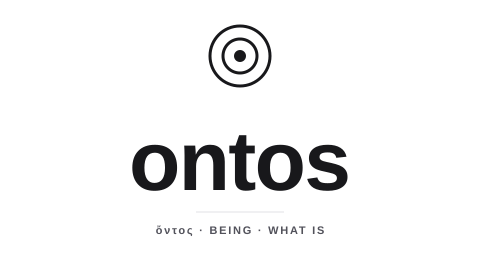

<p align="center">
  <picture>
    <source media="(prefers-color-scheme: dark)" srcset="./docs/img/ontos-wordmark-dark.svg">
    
  </picture>
</p>

<p align="center"><em>ὄντος — of that which is.</em></p>
<p align="center"><em>One vocabulary of being, shared by everything built above it.</em></p>

---

> ὄντος — the genitive of ὄν, *being.* From it we get *ontology*: an account of
> what there is.

**ontos is that account, made concrete.** It is the shared model of *what things are*: the
common vocabulary of values that other systems reason over, attest to, store and exchange. It
is the ground floor everything else stands on, and it is deliberately the most foundational,
most opinion-free layer in the stack.

ontos does not reason. It does not persist. It does not decide what is true. It says only one
thing, and says it the same way everywhere: **here is a thing, and here is the kind of thing
it is.**

## Why it exists

More than one system needs to agree on what data *is* before it can do anything interesting
with it. A logic engine reasons over things. A fact substrate attests to things and chains
authority through them. A store persists them; a wire carries them; a tool renders them. Each
of these is a different *account of meaning*, but they are all accounts of **the same things**.

If every system invents its own notion of a value, then every boundary between them becomes a
translation, and the translations drift, disagree and leak.

ontos removes the seam. It is the one model they all share, so that crossing from one system
to another is not a conversion but an **identity**: the thing on this side *is* the thing on
that side. That is why ontos is its own thing, owned by no consumer.

## The idea

The whole of ontos rests on a single conviction: **there is one kind of being.**

```
Value = Atom(Bytes) | Tuple(Value*)
```

There is no privileged divide between the "primitive" and the "structured", between a number
and a record. Everything that is, is a value of one uniform shape, and two values are equal
exactly when they have the same structure. That uniformity is what makes the model **total**
(everything has a representation), **small** (one notion to learn, implement and verify) and
**translation-free** (nothing has to be reshaped to move between systems).

The richness (numbers, text, lists, records, whatever a domain needs) does not come from adding
special cases to the floor. It comes from naming. *Structural* and *opinion-free* describe the
floor, L0, and above all **equality**, which is fixed there and inherited unchanged by every
layer above. The naming layer `ontos/data` (L2) does take positions, but only about
**representation**: the single canonical spelling of an integer or a decimal. Those are
canonical *forms*, never a new equality, and never arithmetic.

## What ontos refuses to know

- **Truth, inference, proof.** That is reasoning, the province of a logic engine above it.
- **Authority, identity, attestation.** Who said a thing, and whether it counts.
- **Persistence, location, addressing, time.** Where a thing lives, or when.
- **Schema, validation, interpretation.** ontos says that a thing is, and of what kind; it
  does not say what it means, or police it.

## The layers

| layer | what it is | spec |
| --- | --- | --- |
| `ontos/core` (L0) | **frozen.** The value floor, `Atom(bytes) \| Tuple`, with structural identity | [ontos-core.md](docs/spec/ontos-core.md) |
| `ontos/codec` | **frozen as `ontos-codec-v1`.** The canonical byte encoding: a side axis over core, not a semantic layer | [ontos-codec.md](docs/spec/ontos-codec.md) |
| `ontos/compound` (L1) | **frozen.** The labeled-compound reading; adds no values and no identity | [ontos-compound.md](docs/spec/ontos-compound.md) |
| `ontos/data` (L2) | **v1 frozen.** The registered embeddings: `int`, `utf8-text`, `bool`, `list`, `map`, `set`, `decimal`, `null` | [ontos-data.md](docs/spec/ontos-data.md) |
| `ontos-data-json/1` | the named, total projection of a JSON document to an `ontos/data` value | [ontos-data-json.md](docs/spec/ontos-data-json.md) |

Each layer above the floor is a conservative extension: it adds readings that project totally
back to L0, and never defines its own equality.

## One model, four languages

ontos is implemented four times, in Go, Rust, TypeScript and Python, under
[`core/`](core/), [`codec/`](codec/) and [`data/`](data/). The implementations are peers: none is
the reference. They agree **byte for byte**, and the shared conformance corpus in
[`vectors/`](vectors/) pins that agreement; a differential harness holds the four `ontos` CLIs
byte-identical over it on every pull request ([ontos-conformance.md](docs/spec/ontos-conformance.md)).

Bytes in, evidence out: author a value to its canonical `ontos-codec-v1` bytes, then ask the
tool what they are.

```console
$ ontos canon --emit --from-json '{"tuple":[{"atom":"696e74"},{"atom":"00"}]}'
01020003696e74000100

$ ontos inspect 01020003696e74000100
Tuple(Atom(0x696e74), Atom(0x00))
canonical: yes
recognized: int
```

(`696e74` is the label `int` as bytes; the value is `ontos/data`'s embedding of the integer
`0`. The CLI is specified in [ontos-cli.md](docs/spec/ontos-cli.md).)

## Install

TypeScript from npmjs, Rust from crates.io, Go from the module proxy. No credentials needed:

```sh
npm install @bitspark/ontos-core @bitspark/ontos-codec @bitspark/ontos-data
cargo add bitspark-ontos-core bitspark-ontos-codec bitspark-ontos-data
go get github.com/bitspark/ontos@v0.14.0
```

The Rust crates keep their library names, so the code reads `use ontos_core::`. Details, and
the one-version rule for Rust dependency graphs, are in [docs/distribution.md](docs/distribution.md).

## Develop

`scripts/check.sh <target>` (`scripts/check.ps1` on Windows) runs the same checks CI runs, one
per concern: `lint`, `test`, `vectors`, `conformance`, `producer`, `fuzz`, or `all`. The normative
surface is [`docs/spec/`](docs/spec/); read the relevant spec before changing a face, and see
[CONTRIBUTING.md](CONTRIBUTING.md) for what may and may not change.

## History

This repository's history begins at its publication, with v0.13.0. ontos was
developed privately before that; references of the form `ontos-internal#N` in the code and the
documents point into that private history.

## License

[Apache-2.0](LICENSE).

<p align="center"><sub><em>Name the thing. Everything else is what you do with it.</em></sub></p>
